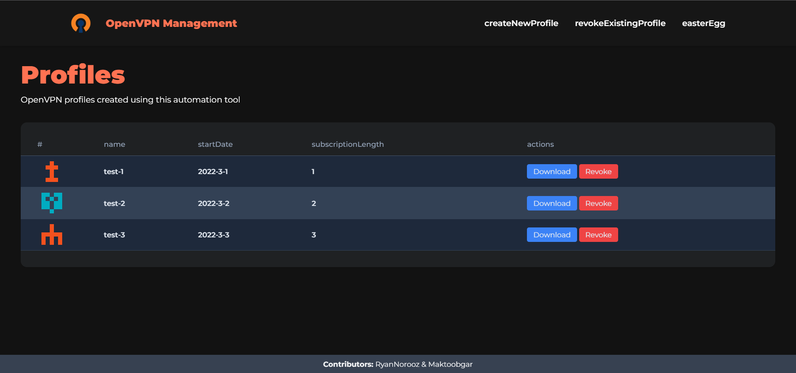
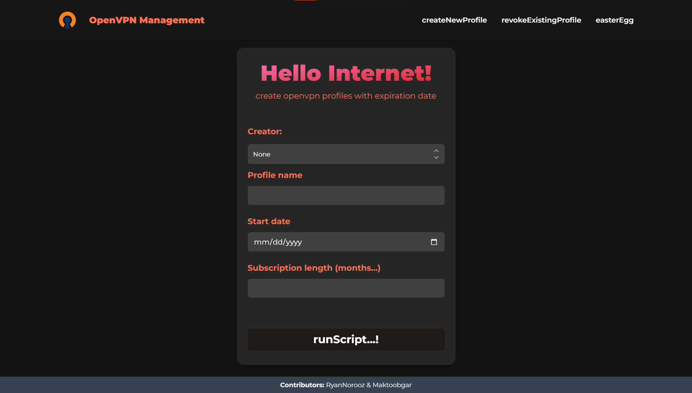

# Automation Tool for OpenVPN Server

Manage OpenVPN profiles from the web interface.

**⚠ Work in progress! might be highly unstable**

_**DISCLAIMER!** This project was created for experienced users (system administrators) and private (e.g., protected by network policies) environments only. Thus, it is not implemented with security in mind (e.g., it doesn't strictly check all parameters passed by users, etc.). It also relies heavily on files and fails if required files aren't available._

### features

- [ ] ✏ Create
- [ ] ⛔ Revoke
- [ ] ⬇ Download
- [ ] ⚡ mass create profiles
- [ ] 🔑 create password protected profiles
- [x] 🔐 better security compared to OpenVPN defaults

## Screenshots

main page

createprofile page

## Install Dependencies

- **[PNPM](https://pnpm.io/) -** _install pnpm if you haven't already_ \
  `npm i -g pnpm`

- **[Install Deps](https://pnpm.io/cli/install) -** _setup dependencies_ \
  `npm i` | `yarn` | `pnpm i`

## Scripts

- **[Development](https://nextjs.org/docs/getting-started#manual-setup) -** _run dev server_ \
  `npm run dev` | `yarn dev` | `pnpm dev`

- **[Build](https://nextjs.org/docs/getting-started#manual-setup) -** _build for production_ \
  `npm run build` | `yarn build` | `pnpm build`

- **[Start](https://nextjs.org/docs/getting-started#manual-setup) -** _run production server_ \
  `npm run start` | `yarn start` | `pnpm start`
